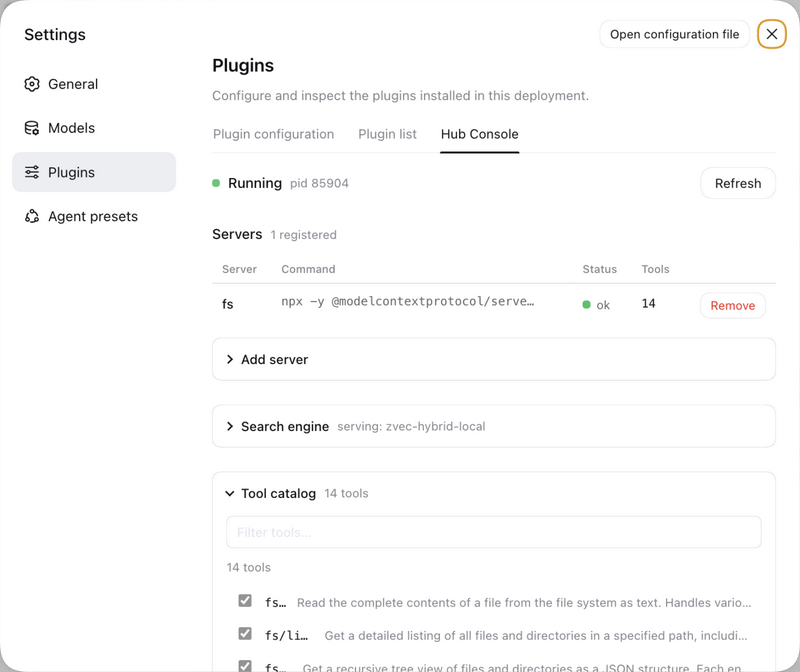
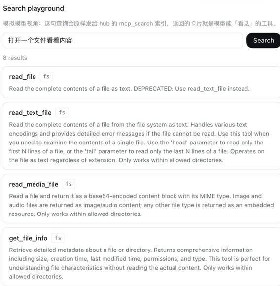

<div align="center">

# ai-plugin

**一条命令，把技能装进主流 harness 共享的标准根——外加一个用约 4 个元工具代理全部 MCP 服务器的网关与管理控制台。**

Claude Code · DeepSeek Harness (dsh) · Codex CLI · Gemini CLI · GitHub Copilot · Cursor · OpenClaw

[](https://github.com/zhangliang0115/ai-plugin/actions/workflows/ci.yml)
[](LICENSE)
[](package.json)
[](https://github.com/zhangliang0115/ai-plugin/stargazers)

[English](README.md) | 简体中文

</div>

---

你的电脑上装了 4 个不同的 AI Agent，你发现一个很棒的技能仓库。然后呢？把文件夹复制进
`~/.claude/skills`，再复制进 `~/.agents/skills`、`~/.gemini/skills`、
`~/.copilot/skills`……上游一更新还得重新来一遍。

**`aipx` 就是为解决这个问题而生的。** 一条命令，把技能装进共享标准根
`~/.agents/skills`（dsh 与 Codex 原生读取）。而 **aipx MCP 网关**用一个只暴露
4 个元工具（search / call / status / refresh）的 MCP 服务器托管你所有的下游 MCP——模型按需搜索、按需调用，
上下文占用不再随 MCP 数量膨胀。内置技能还会教你如何用一个仓库面向所有
harness 发布插件。

```bash
npx github:zhangliang0115/ai-plugin install <owner>/<repo>
```

## 为什么需要

所有 Agent harness 都收敛到了同一个技能格式——`SKILL.md`——但**安装路径**各不相同：

| Agent | 从哪里读技能 |
|---|---|
| DeepSeek Harness (`dsh`) | `~/.agents/skills/` + `<project>/.agents/skills/` |
| Codex CLI | `~/.agents/skills/` + `<project>/.agents/skills/` |
| Claude Code | `~/.claude/skills/` + `<project>/.claude/skills/` |
| Gemini CLI | `~/.gemini/skills/` + `<project>/.gemini/skills/` |
| GitHub Copilot CLI | `~/.copilot/skills/` + `<project>/.github/skills/` |
| Cursor / OpenCode / OpenClaw | 各自的根目录（[完整矩阵](docs/compatibility-matrix.md)） |

插件体系更加碎片化：Claude Code 要 `/plugin marketplace add`，dsh 要
`dsh plugin --profile web add "github:o/r#path:/dsh-plugin"`，Gemini 要
`gemini extensions`。`aipx` 就是缺失的那个公约数：一个安装器、一次同步、一份清单，
通吃所有 Agent。

## 命令

```bash
aipx install owner/repo                          # 自动识别仓库根目录或 skills/
aipx install owner/repo#path:/skills/their-skill # 子目录（与 dsh 相同的语法）
aipx install https://github.com/owner/repo/tree/v1.2/skills/x   # 锁定 ref
aipx install ./my-skill                          # 本地目录
aipx install owner/mcp-server                    # .mcp.json 仓库也能安装 MCP 服务器
aipx install owner/repo --project                # 项目级：.claude/skills、
                                                 # .agents/skills、.github/skills……
                                                 # 随仓库提交，全团队共享

aipx upgrade         # 从记录的来源重装已装技能（等价 --force）
aipx list            # 按 Agent 列出已装技能
aipx search deepseek # 精选注册表；加 --github 实时搜索 GitHub topics
aipx lint skills     # 校验 SKILL.md 质量（frontmatter、触发描述、链接、嵌套）
aipx new my-skill    # 脚手架生成可直接发布的双目标技能仓库
aipx mcp list        # 盘点各 Agent 配置中的 MCP 服务器
aipx mcp import      # 把发现的 MCP 服务器注册进 aipx 网关
aipx mcp serve       # 运行网关：一个 MCP 服务器、约 4 个元工具、上下文零膨胀
aipx remove <name>   # 从所有 Agent 卸载
aipx doctor          # 环境与 Agent 检测报告
```

MCP 网关检索有四档引擎，自动选择：内置词法（零依赖）→ zvec 全文（中文友好）→
**零配置本地混合**（fastembed 小模型自动下载、无 API 无费用；20 条查询评测
top-1 从 8/20 提升至 14/20，中文 0/10 → 9/10）→ 远程 embedding 混合（可选）。
`aipx mcp serve --sidecar "python3 …/sidecars/zvec_sidecar.py"` 即接入。

dsh 用户还可以在 **设置 → Plugins → Hub Console** 面板里管理服务器池、启停
单个工具、浏览工具目录，并用搜索试验场预览模型视角的检索结果。

<p align="center">
  
  
</p>

示例：

```console
$ aipx install JimmyLv/bibigpt-skill#path:/skills/bibi
✔ detected skill with 1 skill(s):
    bibi — Summarize YouTube, Bilibili videos and podcasts…
✔ target roots:
    /Users/you/.agents/skills   (DeepSeek Harness (dsh))
    /Users/you/.claude/skills   (Claude Code)
✔ installed bibi into 2 root(s)
```

## 内置工具包（本仓库本身就是一个插件包）

三种用法：

```bash
# 1. 纯技能，所有 Agent：
aipx install zhangliang0115/ai-plugin

# 2. Claude Code 市场：
#    /plugin marketplace add zhangliang0115/ai-plugin
#    /plugin install ai-plugin-toolkit@ai-plugin

# 3. DeepSeek Harness bundle：
dsh plugin --profile web add "github:zhangliang0115/ai-plugin#path:/dsh-plugin"
```

| 技能 | 教会你的 Agent |
|---|---|
| `skill-author` | 编写能在所有 harness 加载的 SKILL.md 技能 |
| `dsh-plugin-dev` | 打包发布 DeepSeek Harness bundle（cordis.patch.yml、ctx.skills.register、git 安装的坑） |
| `claude-plugin-dev` | 发布 Claude Code 插件与市场 |
| `deepseek-cost-router` | 在 deepseek-chat / deepseek-reasoner 之间路由任务，降低 API 成本 |

## 设计原则

- **零依赖。** 一个关注点一个 JS 文件，`node:test` 测试套件，无供应链风险。
- **非破坏性。** 已存在的目标默认跳过（`--force` 覆盖）；`--dry-run` 预览；
  卸载走清单。
- **诚实的分级。** 官方文档确认的路径默认写入；社区报告的路径（Cursor、
  OpenCode、OpenClaw）需要 `--all` 或 `--agents` 显式指定。
- **标准优先。** 全面采用 SKILL.md；优先符号链接而非复制；以 `~/.agents/skills`
  为同步主根（dsh 与 Codex 本来就共享它）。

## 文档

- [兼容性矩阵](docs/compatibility-matrix.md) — 每个根目录、每个分级
- [安装到 DeepSeek Harness (dsh)](docs/install-into-dsh.md) — 调研指南：技能根、分层、bundle 格式、常见的坑
- [安装到 Claude Code](docs/install-into-claude-code.md) — 市场与插件
- [一次发布，全端生效](docs/publish-dual-target.md) — 双目标仓库布局
- [MCP 网关指南](docs/mcp-hub.md) — 元工具、事务记录、控制台
- [检索引擎与评测](docs/mcp-hub-vector-search.md) — 词法/全文/混合四引擎与 20 查询评测
- [dsh 快捷指令](docs/dsh-quick-actions.md) — dsh 原生自定义提示词机制与边界
- [MCP 生态决策](docs/mcp-ecosystem.md) — 哪些用现成、哪些自研

## 环境要求

Node.js ≥ 20 与 `tar`（macOS、Linux、Windows 10+ 均内置）。无需 `npm install`——
`npx github:zhangliang0115/ai-plugin` 直接从仓库运行；也可全局安装 `npm i -g @zhangliang0115/aipx`。可选：`GITHUB_TOKEN`
提升 API 速率限制。

## 路线图

- [x] v0.1 — install / list / search / remove / doctor
- [x] v0.2 — 项目级安装、`aipx new` 脚手架、`aipx upgrade`、`aipx lint`
- [x] v0.3 — MCP 配置同步、注册表校验 bot + 网站 + 安装冒烟
- [x] v0.4 — **MCP 网关**（`mcp import` / `mcp serve`）、六技能工具包
- [x] v0.5 — **hub 控制台**（dsh 设置页面板：服务器池、工具启停、搜索试验场）、四档检索引擎（零配置本地混合，评测 8/20→14/20）、prompt-cache 稳定化、`aipx doctor` hub 健康段、registry 扩至 24 条全核验
- [ ] then — npm 发布（待 NPM_TOKEN）、Homebrew tap、技能分析钩子（可选）

详见 [ROADMAP.md](ROADMAP.md) 与 [CHANGELOG.md](CHANGELOG.md)。

## 参与贡献

欢迎 PR——尤其是新增精选注册表条目和确认社区级根路径。参见
[CONTRIBUTING.md](CONTRIBUTING.md) 与
[插件提交模板](.github/ISSUE_TEMPLATE/plugin-submission.md)。

## 许可证

[MIT](LICENSE) © 2026 zhangliang0115
