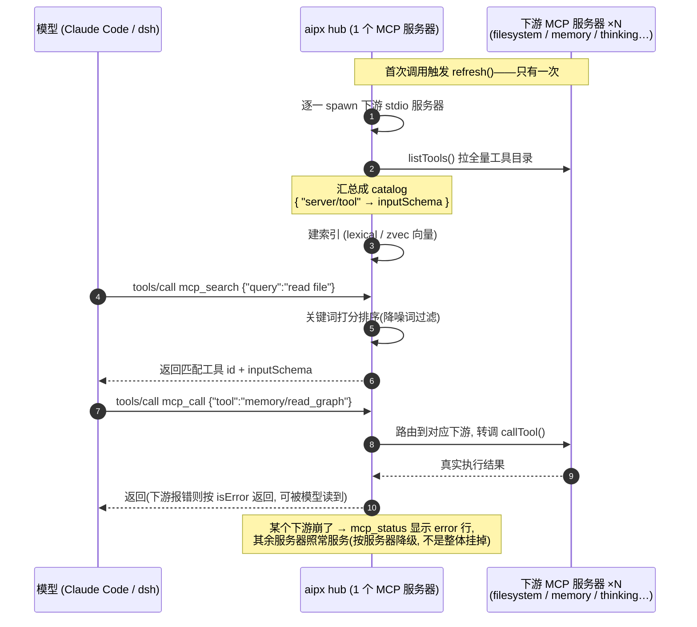
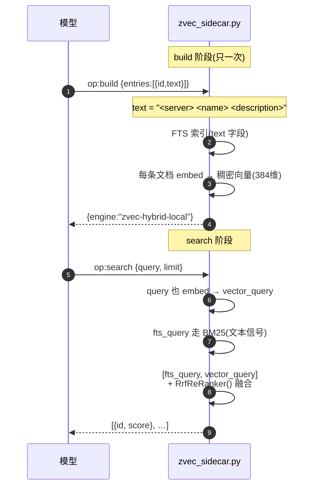
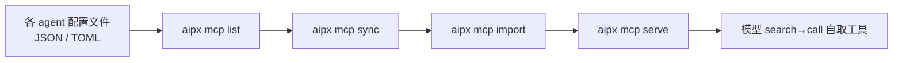

# MCP 工具工作流 — 运行时 hub + 配置同步

aipx 里跟 MCP 打交道的有两条链路,分开看:

- **配置侧** — `aipx mcp` 把服务器定义在不同 agent 的配置文件之间搬来搬去。
- **运行时侧** — `aipx mcp serve` 起一个 hub,替模型挡掉下游服务器的工具爆炸。

> 核心思想:不用 20 个服务器 × 10 个工具直接塞进模型上下文,而是用
> **1 个 hub 服务器**前置所有下游,只暴露 4 个 meta 工具,让模型先搜索再调用。

---

## 一、运行时:search → call 闭环

模型永远只看到 4 个 meta 工具(`mcp_search` / `mcp_call` / `mcp_status` / `mcp_refresh`),
而不是几十个下游工具目录。上下文成本恒定,不随服务器数量增长。



### 没有 hub 时 vs 有 hub 时

```text
朴素做法:  20 服务器 × 10 工具 = 每轮都吃进几万 token 工具定义

hub 做法:  模型  →  search(query)  →  get inputSchema  →  call(tool)
                 ↑ 只付"用到的那个工具"的 token
```

### 实现要点(src/hub/index.js)

- **refresh 只跑一次**:首次调用 `mcp_search`/`mcp_call` 前自动 refresh,之后复用。
- **catalog 与索引分开构建**:先建 entry map 再整体替换,并发搜索永远看不到半空的目录。
- **prompt-cache 稳定**:按 id 排序构建索引,同样的工具集永远得到同样的搜索结果。
- **下游按服务器降级**:一个下游崩了,`mcp_status` 显示 error 行,其余继续服务。

---

## 二、检索引擎:向量信号 + FTS 信号(RRF 融合)

hub 的搜索不是"一个向量机制",而是同一个索引里的**两路打分信号**最后靠
**RRF(Reciprocal-Rank Fusion)融合**。注意:这里没有并发"信号量"(semaphore)
原语——"信号"指**稀疏的全文/FTS 信号**和**稠密的向量信号**,两路评分。

### 两路信号各自动什么

| | 向量信号 | FTS/文本信号 |
|---|---|---|
| 代表 | 稠密 embedding(语义) | BM25 稀疏打分(关键词) |
| 输入 | `query` 喂进 embedder | `query` 喂进 jieba-aware 分词 |
| 覆盖场景 | 词汇缺口:`folder↔directory` | 术语同义:精确关键词命中 |
| 缺了会怎样 | 术语差(如 bge-small-zh 打分近乎全平) | 语义差(同义词配不上) |

### build + search 流程



融合公式:两个信号各按 rank 排好,取 `Σ 1/(k + rank)`,把稀疏/稠密的顺序差
变成同一把尺子再排出最终 top-k。zvec 里就是
`zvec.Query(queries=[fts_query, vector_query], reranker=zvec.RrfReRanker())`
(`sidecars/zvec_sidecar.py:249`)。

### 实际在场的引擎(降级链)

向量不是必选项——hub 的规则是"增强器不许变成硬失败",所以有一条退化链,
谁在场由 `mcp_status` 的 `engine` 字段报出来:

```text
zvec-hybrid-local   本地小模型 embed(默认, ~220MB, EN/ZH, 零配置)
       │ AIPX_EMBEDDING_API_KEY 设了 → 换成远端 API
zvec-hybrid         远端 OpenAI 兼容 embed 端点
       │ 没 embedder / 不可用
zvec                只剩 FTS 全文
       │ `pip install zvec` 没装
tf                  依赖极少的 idf×tf 打分器(Python 端兜底)
       │ 以上全部失败
lexical             JS 端 LexicalIndex(src/hub/lexical.js:8, +2/-1 关键词)
```

两层兜底逻辑:

- **Python 侧**(`sidecars/zvec_sidecar.py:265` `make_engine`):`zvec` 没装 →
  `tf`;装了就 `ZvecEngine`,embedder 决定是 hybrid 还是纯 zvec。
- **JS 侧**(`src/hub/lexical.js:43` `withLexicalFallback`):把向量主索引包一层,
  primary 构建/搜索一旦报错或超时 → **永久**降级到 `LexicalIndex`,本轮会话不再
  重试(避免反复失败拖垮每轮搜索)。

### 两个细节

- **id 编码**(`sidecars/zvec_sidecar.py:53`):zvec 的 doc id 只认
  `[A-Za-z0-9_.-]`,hub 的 id 是 `"server/tool"` 形式,所以写入前 `encode_id()`
  把 `/` 等字符百分号编码,另一边存 `_ids` 映射还原——保证无碰撞。
- **稳定排序**:两路引擎最后都 `.sort(key=(-score, id))`,所以同一批工具集不管
  配置乱序,搜索结果都一致——对 prompt-cache 友好(`src/hub/index.js:85`)。

---

## 三、配置侧:`aipx mcp` 四步

```text
aipx mcp list        # 清点:扫各 agent 的配置文件,按 tier 列出服务器
aipx mcp sync <name> # 拷贝:从"已经配好的地方"复制到其他可写的配置(JSON 合并 / TOML 保留其余段)
aipx mcp import      # hub 侧:把 agent 配置里扫到的服务器登记进 ~/.config/aipx/mcp-hub.json
aipx mcp serve       # 启动 hub,让模型用 mcp_search 来搜
```

整体链路:



### 各 agent 的配置位置与格式(src/mcp.js 的 MCP_TARGETS)

| Agent | 配置文件 | 格式 | Key | 层级 |
|---|---|---|---|---|
| Claude Code | `~/.claude.json` | JSON | `mcpServers` | official |
| Gemini CLI | `~/.gemini/settings.json` | JSON | `mcpServers` | official |
| Codex CLI | `~/.codex/config.toml` | TOML | `[mcp_servers.NAME]` | official |
| Cursor | `~/.cursor/mcp.json` | JSON | `mcpServers` | community |
| GitHub Copilot CLI | `~/.copilot/mcp-config.json` | JSON | `mcpServers` | community |
| OpenCode | `~/.config/opencode/opencode.json` | JSON | `mcp` | community |
| Reasonix | `~/.reasonix/config.toml` | TOML-array-of-tables | `plugins` | official |

> dsh 走自己的 bundle / `cordis.patch.yml` 插件配置,不适用平铺服务器列表
> (所以 MCP_TARGETS 里故意不含 dsh)。

### 写入策略

- **JSON 目标**:合并,绝不覆盖,无关键和其他服务器都保留。
- **Codex TOML**:只动 `[mcp_servers.NAME]` 那一节,`[model]`、`[profile]` 等逐字节保留。
- **远程(url)服务器**:Codex TOML 写入器暂不支持 stdio 之外的形状,带警告跳过。
- **OpenCode**:定义形状不同(`command` 为数组),目前只读,打印定义让用户手动加。
- **community 层**(Cursor / Copilot / OpenCode)需要 `--all` 或 `--agents` 才写,与 skill 安装同一策略。

相关文档:[docs/mcp-hub.md](mcp-hub.md) · [docs/mcp-sync.md](mcp-sync.md) · [docs/mcp-ecosystem.md](mcp-ecosystem.md)
